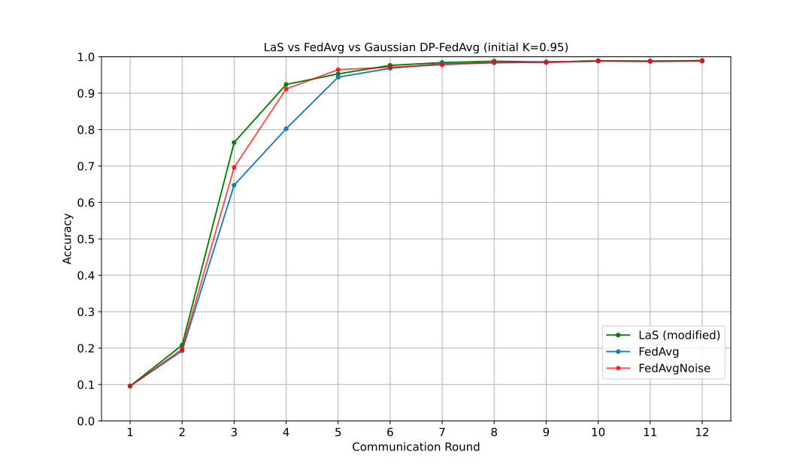

# 🔗 Modified Localize-and-Stitch for Federated Learning

**localize-stitch-modified** is a lightweight PyTorch implementation of an  
_**adaptive**_, **dataless** model–merging algorithm that outperforms  
**FedAvg** on highly non-IID data.

<p align="center">
  
  <br>
  <em>MNIST (α = 0.15) – our LaS converges faster and higher than FedAvg / FedAvg+Noise.</em>
</p>

---

## ✨ Highlights
| Feature | This repo | Original LaS (He et al. 2024) |
|---------|-----------|--------------------------------|
| **Dynamic sparsity** \(K_t = 1 - \mu·\text{acc}\) | ✅ | ❌ (fixed 1 %) |
| **Harmonic stitch** (divide by #non-zero) | ✅ | ❌ (plain mean) |
| **Multi-round FL loop** | ✅ | ❌ |
| **No data / gradients shared** | ✅ | ✅ |
| Works on **ViT-Small/16** & CNNs | ✅ | ✅ |

---

## 1 | Installation
```bash
git clone https://github.com/ifirdavs/localize-stitch-modified.git
cd localize-stitch-modified
conda env create -f environment.yml   # or pip install -r requirements.txt
````

---

## 2 | Quick Start

### Train 5 imbalanced clients on DTD then merge

```bash
python fl_localize_stitch_vit_dtd.py --rounds 12 --alpha 0.15 \
       --epochs 3 --mu 0.01 --backbone vit_small_patch16_224
```

Flags:

| Flag       | Meaning                                                    | Default |
| ---------- | ---------------------------------------------------------- | ------- |
| `--rounds` | global communication rounds                                | `12`    |
| `--alpha`  | Dirichlet skew (lower → more non-IID)                      | `0.15`  |
| `--mu`     | controls **K** schedule,  $K_t=1-\mu\cdot\text{acc}_{t-1}$ | `0.01`  |
| `--noise`  | add Gaussian noise to FedAvg baseline                      | *off*   |

Outputs:

```
checkpoints/
├── round_00/
│   ├── client0_ep3.pt  … client4_ep3.pt
├── round_12/
│   ├── stitched.pt
│   ├── federated_avg.pt
└── plots/
    └── __dtd.svg
```

---

## 3 | Algorithm Sketch

> **Localize:** keep top-$K_t\%$ weight deltas per client
> $M_{i,j}^{(t)} = \mathbf{1}\bigl(|\Delta W_{i,j}^{(t)}|\ge\tau_i\bigr)$

> **Stitch:** harmonic mean over non-zero contributors
>
> $$
> \Delta W_j^{(t)}=\frac{\sum_{i} M_{i,j}^{(t)}\Delta W_{i,j}^{(t)}}{\max(1,\sum_i M_{i,j}^{(t)})}
> $$

> **Schedule:** $K_t = 1 - \mu \cdot\text{Acc}_{t-1}$   ($\mu{=}0.01$ ⇒ ≈95 % after a few rounds)

See `las.py` for <30 LOC core logic.

---

## 4 | Results (12 rounds, α = 0.15)

| Dataset | FedAvg | FedAvg + Noise | Modified LaS |
| ------- | :----: | :------------: | :----------: |
| MNIST   | 98.5 % |     96.8 %     |  **98.8 %**  |
| EuroSAT | 84.1 % |     79.6 %     |  **87.0 %**  |
| DTD     | 51.6 % |     46.2 %     |  **57.4 %**  |

Complete plots in `figures_png/`.

---

## 5 | Cite

```bibtex
@misc{ismoilov2024lasfl,
  title   = {Localize-and-Stitch Modified: Adaptive Sparse Model Merging for Federated Learning},
  author  = {Firdavsbek Ismoilov},
  year    = {2024},
  url     = {https://github.com/ifirdavs/localize-stitch-modified}
}
```

---

## 6 | License

MIT – free to use, modify, and distribute.

